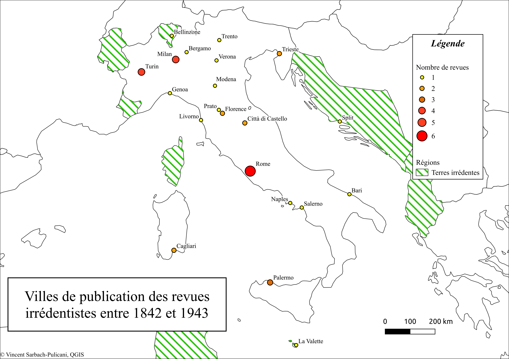
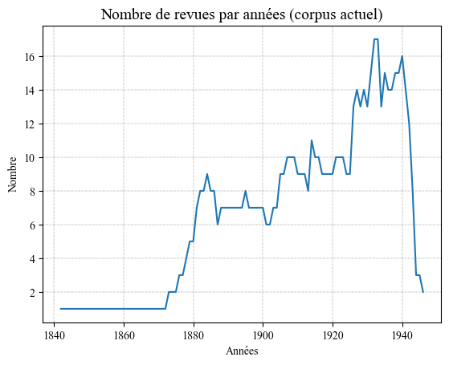
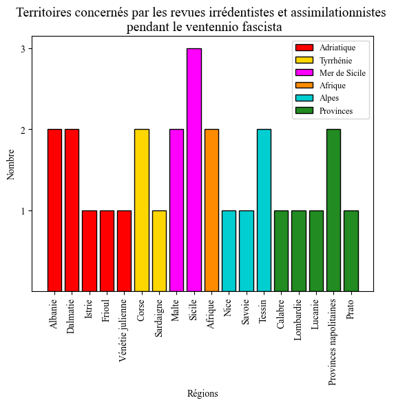

# [Analysis of political discourse in Italian irredentist periodicals (1861-1943)](https://www.theses.fr/s372205)

## Presentation

**Basic informations**

The PhD project is entitled *A Mediterranean of the written word. Circulation and diffusion of the irredentist doctrine from liberal from liberal Italy to the fascist mare nostrum (1861-1943)*. It is conducted by Vincent Sarbach-Pulicani at Université Côte d'Azur, under the supervision of Jean-Paul Pellegrinetti (UPR 1193 CMMC).

**Small description**

When the Fascists came to power in 1922, they added a new dimension to Italy's claim to the Mediterranean. The idea of an "inland lake" over which the Italian people would reign supreme - the Fascist *mare nostrum* - was born. The end of the First World War and the advent of Mussolini breathed new ideological life into irredentism, a political and cultural movement that sought to annex lands considered Italian but not part of Greater Italy. However, the roots of irredentism go back to the 19th century and the intellectual circles surrounding the *Risorgimento*. Some theorists of Italian nationalism believed that the movement for Italian unity could not be completed until all irredentist lands had been "redeemed". To support this idea, a large number of historical, archaeological and literary journals were produced to highlight the cultural links between Italy and the irredent lands. The aim of this thesis is to study a systematic corpus of journals in space and time. The idea is to understand how irredentist discourse has adapted according to the territories concerned and the general political context. Our questions also concern the very definition of irredentism: should this movement be considered as a doctrine in its own right, with its own common logic and structures? We will also be looking at the new impetus given by fascism, examining continuities and reinventions. To complete these considerations, we need to shed light on the places and actors involved in the production of irredentist journals, as well as the relays for the dissemination of propaganda within irredentist lands themselves. Appropriate tools and methods from the digital humanities will be used to carry out this research. Political discourse will be analysed using logometric and lexicometric techniques, and the prosopographical aspect of the study will be supported by a database of those involved in the production of the journals. This research fits in perfectly with the historiographical renewal surrounding the history of fascism, which is increasingly interested in its transnational and international dimensions. In this respect, we can mention [EUROFA](https://anr.fr/en/funded-projects-and-impact/funded-projects/project/funded/project/b2d9d3668f92a3b9fbbf7866072501ef-43cf77d376/?tx_anrprojects_funded%5Bcontroller%5D=Funded&cHash=3369b2b45268bde3c75b2b14e11727e1), an international research project funded by the ANR (*Agence Nationale de la Recherche*, France) and coordinated by Pr. Jean-Paul Pellegrinetti (*Université Côte d'Azur*).

**The corpus, some EDA**

The corpus currently comprises around 40 periodicals from 1861 to 1943. Sorting is not necessarily easy, as it is difficult to project the depth of the analysis. This is why the corpus also includes so-called assimilationist journals, for possible comparison with irredentist journals.  Here we present a map and two graphs to help you understand our dataset. Some journals are not digitised, but they are included in the database (manual entries) to complete the quantitative analyses. For purely computational analyses, OCR will be required to obtain the textual data.

